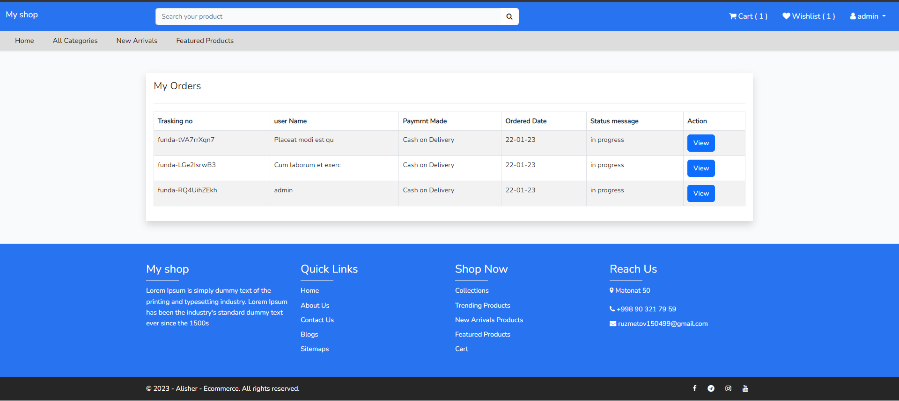

***

My eCommerce 
 

***
```
composer install  
```
***
```
copy .env.example .env 
```
***
```
php artisan key:generate 
```
***
```
php artisan migrate 
```
***
```
npm install & npm run dev 
```
***
```
php artisan serve
```
***

***

***

***

***

***

***
